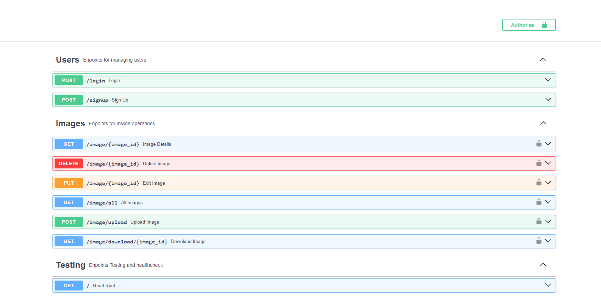
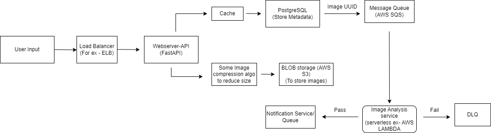

# Image Analysis Platform Lite

## Table of Contents
- [Image Analysis Platform Lite](#image-analysis-platform-lite)
  - [Introduction](#introduction)
  - [Installation](#installation)
  - [Usage](#usage)
    - [Testing](#testing)
    - [Database Migrations](#database-migrations)
  - [Project Structure](#project-structure)
  - [Implementation Details](#implementation-details)
    - [Configurations](#configurations)
    - [Schema](#schema)
  - [To-Do](#to-do)
  - [License](#license)


## Introduction

Built this Image Analysis Platform as per instructions and to the best of my knowledge.

**Features**
- All the critical endpoints are secured using JWT.
- Checks for permission without providing the data.
- Login and signup endpoints for their respective functions.
- Support for Database migrations using Alembic.
- Dockerised for deployment.

## Installation/Setup

1. Clone the repository:

    ```bash
    git clone https://github.com/shekhuverma/Image-Analysis-Platform.git
    cd Image-Analysis-Platform
    ```
2. Create a virtual environment and activate it
   ```bash
   python -m venv venv
   ```
   Activate it using
   ```bash
   #on windows
   venv\Scripts\Activate
   #on linux
   source venv/Scripts/Activate
   ```
3. Install dependencies:

    ```bash
    pip install -r requirements.txt
    ```
Note - Currently dependencies are not seperated into dev and test.

## Usage
1. Configure the environment variables in the template.env file and rename it to
   .env
2. Run alembic migrations to create the tables in the local DB.
   ```bash
   alembic upgrade head
   ```
   This will initialize the database and create the tables as per models.py
3. Add initial data to the database (test user)
   ```bash
   python -m src._init_db
   ```
   This will add a dummy user to the database.
4. Run the application:

    ```bash
    cd src
    uvicorn main:app --reload
    ```
    or

    ```bash
    cd src
    fastapi dev
    ```

5. Optionally you can set pre-commit hooks using
    ```
    pre-commit install
    ```

6. Visit `http://localhost:8000/docs` in your browser to access the API docs.



**NOTE** : It needs a local redis server to work correctly.

## Docker
For deployment using docker, edit the docker compose file and fill in your environment variables.
Uses Nginx as load balancer and reverse proxy to expose the container to internet.

### Testing
All the tests are done using Pytest.

To run all the tests, run the following command

```bash
pytest tests
```

or you can use tox for testing and linting
```
tox
```

This will run all the tests, formats and lints the code using Ruff.

Tests are divided into 3 major types
1) Database tests - Contains the unit tests for database services and operations.
2) User tests - Contains tests for all the user endpoints.
3) Image tests - Contains tests for all the image endpoints.

### Database Migrations
If you change anything in the models.py file, then delete all the files from the alembic/versions directory and run the following command to generate the new migration.
```bash
alembic revision --autogenerate -m "your message"
```
then run, so that migrations can take effect
```
alembic upgrade head
```
This will create a new migration with your changes in the models.

## Project Structure

```text
|   .pylintrc                       # Pylint configuration
|   alembic.ini                     # Alembic Config
|   LICENSE                         # License File
|   README.md                       # Project Readme
|   requirements.txt                # Dependencies
|   docker-compose.yml              # Docker compose file
|   Dockerfile                      # Docker file
|
+---alembic                         # Alembic config folder
|   ├── env.py
|   ├── README
|   ├── script.py.mako
|   └── versions
|       └── 2024_10_04_init_db.py   # Migration to initialise the DB
+---src                             # Source code folder
|   ├── _init_db.py                 # To initialise the database using superuser (First admin)
|   ├── main.py                     # Main.py, the app starts from here
|   ├── settings.py                 # Config and settings for the project
|   ├── db                          # Database related files
|   │   ├── database.py
|   │   ├── model.py
|   │   └── services.py
|   ├── docs                        # FastAPI Documentation metadata
|   │   ├── docs.py
|   ├── router                      # API routes files
|   │   ├── image.py
|   │   ├── user.py
|   ├── schemas                     # Pydantic models for request/response schemas
|   │   ├── image.py
|   │   ├── token.py
|   │   ├── users.py
|   ├── security                    # Security related files
|   │   ├── jwt.py                  # JWT generation code
|   │   ├── security.py             # Authentication and OAuth2
|   │   └── utils.py                # Misc helper functions
|   |
+---tests                           # Test files
|   ├── image_test.py               # Image related endpoint tests
|   ├── conftest.py                 # Test Fixtures
|   ├── database_test.py            # Database services unit tests
|   └── user_test.py                # Login and singup endpoints tests
```

## Implementation Details

### Configurations
All the general configurations are in the setting.py file and .env file. Most of which are self-explanatory.
Used Pydantic-settings for dividing the configuration settings.

### Database Schema
src/db/models.py

```text
users ->
    id                  # Integer, Autoincrement, PRIMARY KEY
    username            # varchar, Username of user ,UNIQUE
    email               # varchar, Email of user 
    disabled            # Bool, To disable the admin
    hashed_password     # varchar, Password stored as hash
```
```text
images ->
    image_id            # UUID, PRIMARY KEY
    user_id             # Integer REFERENCES users(user_id) ON DELETE CASCADE,
    original_filename   # VARCHAR(255), Stores the original filename of the image
    width               # Integer, Image Width
    height              # Integer, Image Height
    file_size           # Integer, Image size
    file_type           # varchar, Image file type
    upload_date         # Date, To store the upload datetime
    last_modified       # Date, To store the datetime on edit
```
### Rough Implementation Idea

1) Client Request goes to Load balancer which divides the load into different nodes. Each node is running multiple replicas of our fastapi webserver using nginx as reverse proxy.
2) After load balancer we can either have a auto-scalling group to ensure realiability in high traffic scenes.
3) Any database request goes to our caching layer first(Redis) to reduce database load and latency.
4) The uploaded images in first compressed to reduce it's size, renamed to it's UUID (This will act as a primary key to identify the image) and then pushed into AWS s3.
5) This generated Image UUID is passed to a message Queue (AWS SQS for ex)
6) Image analysis service (Queue Consumer) which is on a severless infrastructure fetches the data from the queue periodically or through whenever a set number of messages are available on the queue for processing.
7) After processing the results are pushed to another queue where we can use some sort of notification service to notify the users.


## Scope for Improvements/ Known issues
- [ ] Seprate the user and dev dependencies (By using PDM or poetry).

## License

This project is licensed under the [MIT License](LICENSE).
